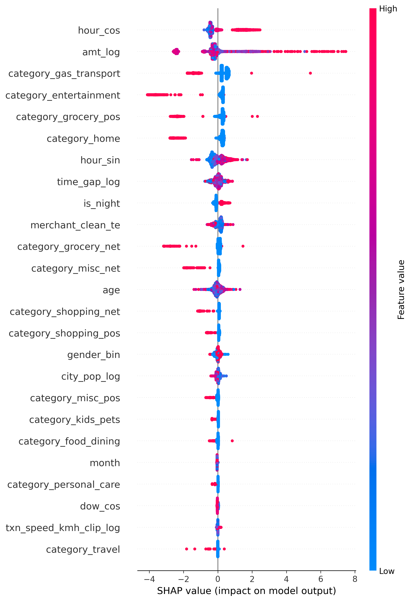
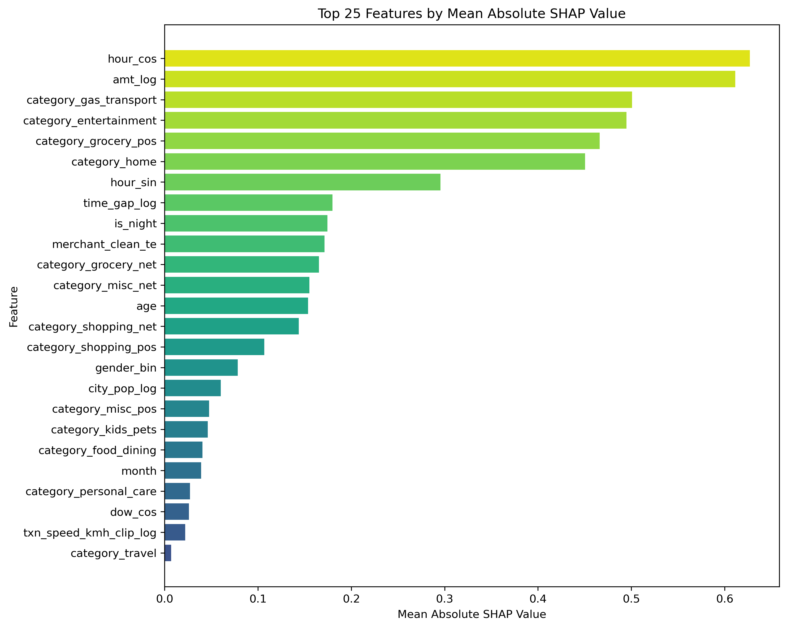

# Credit Card Fraud Detection Pipeline

<p align="center">
  
</p>

## Dataset Setup

The raw datasets are excluded from this repository due to GitHub file size limitations.

Dataset source:
https://www.kaggle.com/datasets/kartik2112/fraud-detection

After downloading the datasets from Kaggle, place the following files inside the `Data/` folder:

- fraudTrain.csv
- fraudTest.csv

## 1. Project Overview

This project develops an end-to-end machine learning fraud detection pipeline using structured transaction-level credit card data.

The project focuses on:

- fraud risk prediction
- behavioral feature engineering
- leakage-safe preprocessing
- imbalanced classification modeling
- ranking-based fraud prioritization
- model interpretability using SHAP

The final solution compares multiple machine learning models and selects the strongest fraud detection pipeline based primarily on PR-AUC and ranking performance.

## 2. Business Objective / Why This Matters

This project simulates a realistic fraud analytics workflow used in fintech and banking because financial institutions must balance fraud prevention with minimizing false positives for legitimate customers.

This project develops an end-to-end machine learning pipeline for detecting rare fraudulent transactions under severe class imbalance using behavioral transaction analytics, interpretable modeling, and ranking-based fraud prioritization.

## 3. Key Results

- Final CatBoost PR-AUC: 0.876
- Fraud Recall: 75%
- Precision: 92%
- Top 500 ranked transactions achieved 100% precision
- Behavioral transaction patterns outperformed demographic variables

## 3. Dataset Overview

The dataset contains historical credit card transactions labeled as fraudulent or non-fraudulent.

The data includes:

- transaction timestamp
- merchant
- transaction category
- transaction amount
- geographic coordinates
- customer demographics
- behavioral transaction patterns

Dataset size:

- Train rows: 1,296,675
- Test rows: 555,719

Target variable:

- `is_fraud`

Fraud rate is extremely low, making this a highly imbalanced classification problem.

## 4. Technologies & Libraries

### Core Programming
- Python
- Jupyter Notebook

### Data Processing
- pandas
- numpy

### Visualization
- matplotlib
- seaborn

### Machine Learning
- scikit-learn
- XGBoost
- LightGBM
- CatBoost

### Model Evaluation
- PR-AUC
- ROC-AUC
- Precision / Recall
- F1 Score
- Precision@K / Recall@K

### Explainability
- SHAP

### Validation Strategy
- TimeSeriesSplit
- StratifiedKFold

### Pipeline & Modularization
- sklearn Pipeline
- reusable preprocessing artifacts
- custom feature engineering modules

## 5. Project Structure

```text
Capstone3 - Credit Card Fraud Detection/
│
├── notebooks/
│   ├── data_cleaning_feature_engineering.ipynb
│   ├── eda_visualization.ipynb
│   ├── modeling_on_train.ipynb
│   └── test_deployment_final_evaluation.ipynb
│
├── src/
│   ├── feature_engineering.py
│   ├── preprocessing.py
│   ├── modeling.py
│   └── evaluation.py
│
├── outputs/
│   ├── figures/
│   └── metrics/
│
├── presentation/
├── project_docs/
├── requirements.txt
└── README.md

## 6. Pipeline Overview

Raw Transaction Data
↓
Feature Engineering
↓
Behavioral Features
↓
Train-Only Preprocessing
↓
Target Encoding / One-Hot Encoding
↓
Train/Test Transformation
↓
Model Training
↓
Model Evaluation
↓
SHAP Interpretation
↓
Fraud Ranking Analysis

## 7. Feature Engineering

The project engineered several behavioral and temporal fraud indicators:

- transaction distance
- transaction speed
- transaction time gap
- amount log transformation
- cyclical time encoding using sine/cosine
- merchant normalization
- merchant-type extraction
- customer age
- high transaction amount indicators

The pipeline also handled skewed distributions through clipping and log transformation to reduce sensitivity to extreme outliers.

## 8. Feature Engineering

The project engineered several behavioral and temporal fraud indicators:

- transaction distance
- transaction speed
- transaction time gap
- amount log transformation
- cyclical time encoding using sine/cosine
- merchant normalization
- merchant-type extraction
- customer age
- high transaction amount indicators

The pipeline also handled skewed distributions through clipping and log transformation to reduce sensitivity to extreme outliers.

## 9. Leakage Prevention

Several steps were implemented to minimize target leakage:

- Train-only target encoding
- Train-only preprocessing artifacts
- Train-only imputation statistics
- Time-aware validation
- Consistent train/test feature alignment

The preprocessing pipeline separates fitting and transformation stages to ensure future information is not leaked into training.

## 10. Model Comparison

The project compared both linear and nonlinear machine learning models:

- Logistic Regression
- Random Forest
- XGBoost
- LightGBM
- CatBoost

The goal was to evaluate how fraud behavior behaves under:

- linear assumptions
- nonlinear interaction modeling
- ensemble boosting approaches

Because fraud behavior is highly nonlinear and interaction-driven, tree-based boosting models substantially outperformed linear models.

## 11. Final Model

CatBoost was selected as the final model because it:

- achieved the strongest PR-AUC
- handled categorical variables effectively
- captured nonlinear interactions strongly
- reduced leakage risk through ordered boosting

Final CatBoost performance:

- ROC-AUC: 0.994
- PR-AUC: 0.876
- Strong Precision@K and Recall@K performance under severe imbalance

## 12. Why Accuracy Is Misleading

Fraud detection is a highly imbalanced classification problem.

In this dataset, fraudulent transactions represent only a very small fraction of all transactions. A model predicting every transaction as non-fraud could still achieve extremely high accuracy while completely failing to identify fraud.

Because of this, the project prioritizes:

- PR-AUC
- Recall
- Precision
- Precision@K
- Recall@K

rather than overall accuracy.

## 13. Evaluation Metrics

Fraud detection is a highly imbalanced classification problem, meaning fraudulent transactions represent only a very small percentage of all transactions.

Because of this, traditional accuracy is not a reliable evaluation metric. A model predicting all transactions as non-fraud could still achieve extremely high accuracy while completely failing to identify fraud.

This project therefore prioritized ranking-based and fraud-sensitive evaluation metrics.

### Primary Metrics

#### ROC-AUC
Measures the model’s overall ranking capability across all classification thresholds.

#### PR-AUC
Measures precision-recall tradeoff under severe class imbalance. This was the primary evaluation metric because fraud cases are extremely rare.

#### Precision
Measures how many predicted fraud transactions are actually fraudulent.

#### Recall
Measures how many true fraud transactions were successfully detected by the model.

#### F1 Score
The harmonic mean of precision and recall. This metric evaluates the balance between fraud detection sensitivity and false-positive control.

### Ranking-Based Metrics

#### Precision@K
Measures the percentage of true fraud cases among the top K highest-risk transactions.

#### Recall@K
Measures how much of the total fraud population is captured within the top K highest-risk transactions.

These ranking metrics are especially important in real-world fraud investigation systems because investigation teams can only review a limited number of transactions daily.

## 14. Model Performance

### Model Comparison

| Model | Mean ROC-AUC | Mean PR-AUC |
|---|---|---|
| Logistic Regression | 0.9119 | 0.4382 |
| Random Forest | 0.9809 | 0.8556 |
| XGBoost | 0.9972 | 0.8390 |
| LightGBM | 0.9866 | 0.8574 |
| CatBoost | 0.9955 | 0.9043 |

The results show that tree-based boosting models substantially outperformed linear models, suggesting that fraud behavior is highly nonlinear and interaction-driven.

Among all models tested, CatBoost achieved the strongest overall performance.

### Final Test Deployment Evaluation - CatBoost

Final CatBoost test performance:

- ROC-AUC: 0.9940
- PR-AUC: 0.8762
- Precision: 0.92
- Recall: 0.75
- F1 Score: 0.8230

Confusion Matrix:

```text
[[553428    146]
 [   543   1602]]
```

The model achieved very high fraud precision while maintaining strong fraud recall under severe class imbalance.

This indicates that the model successfully identifies a large portion of fraudulent transactions while keeping false positives relatively low.

### Top-K Fraud Ranking Performance

| Top-K Transactions | Precision@K | Recall@K |
|---|---|---|
| Top 100 | 1.0000 | 0.0466 |
| Top 500 | 1.0000 | 0.2331 |
| Top 1000 | 1.0000 | 0.4662 |
| Top 5000 | 0.3914 | 0.9124 |

The model demonstrated strong fraud prioritization capability.

For example:

- The top 500 highest-risk transactions were all true fraud cases.
- The top 5000 highest-risk transactions captured over 91% of all fraud transactions.

This demonstrates strong ranking performance for real-world fraud investigation workflows, where investigators can only review a limited number of transactions daily.

## 15. SHAP Interpretation

SHAP analysis was used to interpret feature importance and understand the behavioral drivers of fraud prediction.

The most influential features included:

- transaction amount
- time-of-day behavior
- merchant risk
- transaction timing patterns
- transaction category

This improved model transparency and supported business interpretability.

## SHAP Summary Plot



The SHAP summary plot shows both feature importance and directional impact on fraud prediction. Features such as transaction amount, time-of-day behavior, and merchant/category risk strongly influenced fraud probability.

---

## SHAP Feature Importance



Mean absolute SHAP values further confirmed that behavioral timing patterns, transaction amount, and merchant-related categorical features were among the strongest predictive signals.

## 16. Deployment-Oriented Design

The project was designed with reusable preprocessing and deployment workflows in mind.

Key deployment-oriented components include:

- modular feature engineering
- reusable preprocessing artifacts
- train/test transformation consistency
- reusable model evaluation functions
- scalable fraud scoring workflow

## 17. Project Conclusion

The final CatBoost pipeline demonstrated strong fraud-ranking capability under severe class imbalance.

The model successfully prioritized high-risk transactions while maintaining strong fraud recall performance.

The project also demonstrated:

- leakage-safe preprocessing
- reusable ML pipeline design
- ranking-based fraud evaluation
- interpretable fraud modeling using SHAP

The workflow was designed with future deployment and scalable fraud scoring in mind.

## 18. Next Steps

Potential future improvements include:

- sequence modeling using LSTM / Transformer
- graph-based fraud detection
- real-time fraud scoring
- threshold optimization
- fraud ring detection
- drift monitoring
- streaming deployment
- NLP integration for claim narratives or investigation notes